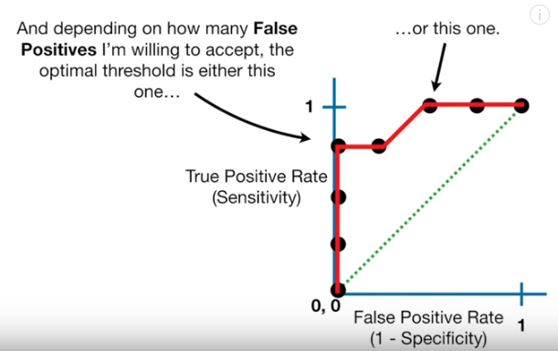

# Machine Learning

## Different kinds

Kinds and their uses

| Supervised                    | Used for                    |
| ----------------------------- | --------------------------- |
| Artificial Neural Networks    | Regression & Classification |
| Convolutional Neural Networks | Computer Vision             |
| Recurrent Neural Networks     | Time Series Analysis        |

| Unsupervised            | Used for               |
| ----------------------- | ---------------------- |
| Self-Organizing Maps    | Feature Detection      |
| Deep Boltzmann Machines | Recommendation Systems |
| AutoEncoders            | Recommendation Systems |

## Terms

### Principal Component Analysis (PCA)

cluster stuff together, for dimension reduction
check up on Heatmaps, t-SNE plots, Multi Dimensional Scaling (MDS)

### Logistic regression
like linear regression, but binary (true or false, 1 or 0) using `S`-shaped "logistic function".
Using Maximum likelihood
can work with continuous data, and discrete data.
Test if a variable's effect on prediction is significantly different from 0.
(Wald's Test)

K-nearest neighbors
support vector machines svm
Random forest model

### (Kohonen’s) Self-Organizing (feature) Maps

Reduce dimensions, from 100 input variables into a 2D map for instance.

### Decision Tree
Binary tree, can be based on numeric data and categories.
Has Root (node) : only arrows starting
(internal) nodes : arrows to and from
and Leaf Nodes or Leaves : only arrows to
**Not flexible when it comes to classifying new samples**

### Random Forests
Multiple Decision Tree's that are generated using random bootstrapped dataset and randomly selected root nodes.
**More flexible than Decision Tree's alone**

#### Bagging
Bootstrapping data + using aggregate to make decision is called Bagging

#### Out-Of-Bag Dataset
Data that didn't end up in bootstrapped data, typically 1/3rd.
The proportion of out-of-bag samples that are incorrectly classified is called the Out-Of-Bag error. Used to change the amount of random variables used per step.

### AdaBoost
Forest of Stumps (Tree's with just one node and two leaves). Weak learners.
Some stumps get more say.
Each stump is made taking previous stumps error's into account, using weighted Gini Function if available, otherwise just Sample Weights to make new dataset.

### impurity
Gini imputity = 1 - (probability of yes)^2 - (probability of no)^2
Lowest impurity is used as root node.

### Receiver Operator Characteristic (ROC)
Thresholds can variate between 0 and 1, 
ROC is a graph of sensitivity over 1 - specificity.

### Precision
Precision = True Positives / (True Positives + False Positives)
Portion of positive results that were correctly classified.
If there are not so much true negatives, not effected by imbalance.
When studying rare disease ofthen the case.

### Area Under the Curve (AUC)
Area, used to compare ROC's, where higher AUC is better.

### Confusion matrices
Matrix that for each option lists the times the prediction was correct and incorrect.
For yes/no:

### Cross Validation
75% for training and 25% for testing, but keep switching the 25% to a different dataset. For instance Four-fold cross validation, split in 4 blocks and train/test 4 times.

leave one out cross validation (individual datapoint is a block)
Ten-fold cross validation (10 parts), often used to tune tuning parameter.

### Sensitivity & Specificity
calulcated from confusion matrix
**sensitivity** = true positives / (true positives + false negatives)
how good at predicting YES
correctly identifying positives

**specificity** = true negatives / (true negatives + false positives)
How good at predicting NO
correctly identifying negatives

### Multi Layer Perceptron (MLP)

### Convolutional Neural Network (CNN)

### RBF
Radial Basis Function
https://towardsdatascience.com/radial-basis-functions-neural-networks-all-we-need-to-know-9a88cc053448

### Knowledge-based CDSS
Logic entered by user, eg:
`IF drug X is taken AND drug Y is taken THEN alert user.`
### Non-knowledge-based CDSS
AI & Machine Learning, allow computers to learn from past experiences and/or find patterns in clinical data

### Transfer learning with inception ??

### recurrent neural network (RNN) ??

### LSTMs ??